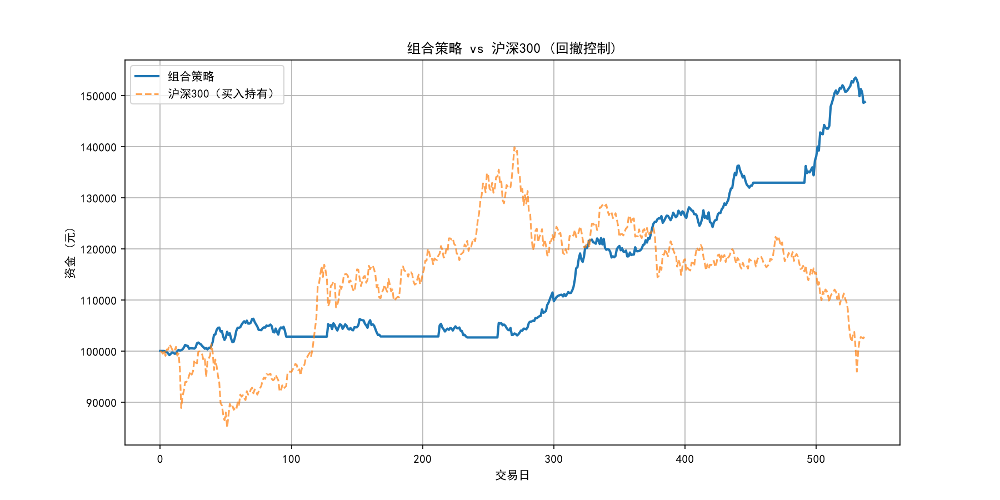

**A股量化回测系统 — 基于LSTM的多任务学习策略**
[](https://www.python.org/)
[](https://pytorch.org/)
[](LICENSE)
## 📖 项目简介
本项目构建了一个**完整的A股量化交易系统**，核心基于 **LSTM 神经网络** 和 **趋势跟踪策略**。系统实现了从**全市数据训练**到**精选股票池组合**的完整链路，并在样本外回测中取得了显著的超额收益。

---

## 🏆 核心成果

### 📊 组合回测结果（30只白名单股票，等权重）

| 指标 | 数值 |
| :--- | :--- |
| **组合总收益率** | **+48.70%** |
| **平均单只收益率** | +144.14% |
| **正收益股票数** | **27/30（90%）** |
| **年化收益率** | 20.42% |
| **最大回撤** | **3.45%** |
| **夏普比率（年化）** | **1.899** |
| **超额收益（vs 沪深300）** | **显著跑赢** |
| **回测区间** | 约 538 个交易日（~2.14年） |

### 📋 白名单前10名（扩展窗口验证）

| 排名 | 代码 | 名称 | 收益率 | 夏普比率 | 最大回撤 |
| :--- | :--- | :--- | :--- | :--- | :--- |
| 1 | 001259 | 利仁科技 | **275.4%** | 1.48 | 10.9% |
| 2 | 002552 | 宝鼎科技 | **261.5%** | 1.80 | 30.5% |
| 3 | 002202 | 金风科技 | **215.3%** | 2.18 | 21.7% |
| 4 | 600367 | 红星发展 | **186.2%** | 1.50 | 30.8% |
| 5 | 000657 | 中钨高新 | **163.7%** | 2.39 | 18.8% |
| 6 | 000586 | 汇源通信 | **142.7%** | 1.48 | 32.8% |
| 7 | 688700 | 东威科技 | **138.9%** | 1.47 | 36.5% |
| 8 | 605599 | 菜百股份 | **134.0%** | 2.58 | 7.8% |
| 9 | 002277 | 友阿股份 | **130.9%** | 1.78 | 13.9% |
| 10 | 688401 | 路维光电 | **123.5%** | 1.61 | 25.9% |

### 📈 资金曲线 vs 沪深300

组合策略在回测区间内持续跑赢沪深300，超额收益显著。



---

## 🎯 核心特性

- ✅ **全市数据训练**：用全市场 5000+ 只股票数据训练统一 LSTM 模型，泛化能力强
- ✅ **多任务学习架构**：同时预测次日收盘价（回归）和涨跌方向（分类）
- ✅ **趋势跟踪策略**：基于 MA200 趋势过滤、动态仓位管理、止盈止损
- ✅ **严格时间验证**：扩展窗口测试（前70%训练，后30%回测），杜绝未来信息泄露
- ✅ **白名单筛选**：通过样本外验证，从全市场筛选出 30 只高质量股票
- ✅ **组合策略**：等权重持仓，分散风险，平滑资金曲线
- ✅ **GPU 加速**：支持 NVIDIA CUDA 训练，大幅提升效率

---

## 🛠️ 技术栈

| 类别 | 技术 |
| :--- | :--- |
| **深度学习框架** | PyTorch 2.x（CUDA） |
| **数据源** | baostock（本地缓存） |
| **数据处理** | Pandas、NumPy、Scikit-learn |
| **可视化** | Matplotlib、Seaborn |
| **模型持久化** | joblib |

### 模型架构


---

## 📂 项目结构

```text
.
├── stock_full2.py              # 核心引擎（数据、模型、回测）
├── batch_backtest.py           # 全市模型批量回测 + 白名单生成
├── expand_whitelist.py         # 白名单扩展（时间分割验证）
├── pool_backtest_analysis.py   # 组合回测 + 绩效分析
├── requirements.txt            # 依赖清单
├── README.md                   # 项目说明
│
├── stock_data_cache/           # 数据缓存目录（自动生成）
├── model.pth                   # 全市模型权重
├── scaler_X.pkl                # 特征标准化器
├── scaler_y.pkl                # 标签标准化器
├── whitelist.csv               # 原始白名单
├── whitelist_extended.csv      # 扩展白名单（30只精选）
├── pool_backtest_results.csv   # 组合回测结果
├── pool_capital_curve.png      # 组合资金曲线图
└── return_distribution.png     # 收益率分布图


🚀 快速开始
1. 安装依赖
pip install -r requirements.txt -i https://pypi.tuna.tsinghua.edu.cn/simple

2. 数据准备
# 首次运行会自动下载数据并缓存到 stock_data_cache/

3. 全市模型训练 + 白名单生成
python batch_backtest.py
程序会：
加载全市场股票数据，训练统一 LSTM 模型
用该模型回测所有股票，生成 whitelist.csv

4. 白名单扩展（时间分割验证）
python expand_whitelist.py
对候选股票进行前70%训练，后30%回测的时间分割验证，生成 whitelist_extended.csv（精选30只）。

5. 组合回测与绩效分析
python pool_backtest_analysis.py
输出：
组合总收益率、正收益股票数、夏普比率
资金曲线图（vs 沪深300）
收益率分布图

🔧 策略参数调优
在 stock_full2.py 中可调整的核心参数：
python
BUY_THRESHOLD = 0.45      # 上涨概率 > 0.45 买入
SELL_THRESHOLD = 0.43     # 上涨概率 < 0.43 卖出
STOP_LOSS = -0.08         # 亏损 8% 止损
TAKE_PROFIT = 0.20        # 盈利 20% 止盈
MAX_POSITION = 0.6        # 单只股票最大仓位 60%
白名单筛选条件（batch_backtest.py）：
python
WHITELIST_MIN_RETURN = 0.30    # 最低收益率 30%
WHITELIST_MIN_TRADES = 3       # 最少交易次数 3
WHITELIST_MAX_DRAWDOWN = 0.52  # 最大回撤 52%
回撤控制参数（pool_backtest_analysis.py）：
drawdown_threshold = 0.035   # 回撤 4% 触发降仓
recovery_ratio = 0.35        # 回撤恢复到 1.6% 时恢复满仓


📊 结果可视化
运行 pool_backtest_analysis.py 后自动生成：
组合资金曲线图 (pool_capital_curve.png)：策略 vs 沪深300
收益率分布图 (return_distribution.png)：30只白名单股票的收益分布
绩效指标表 (pool_metrics.csv)：总收益、年化收益、夏普比率、最大回撤

📧 联系与交流
如有问题或建议，欢迎通过 GitHub Issues 交流。


**⚠️ 免责声明：本项目仅供量化研究与学习使用，不构成任何投资建议。实盘交易需谨慎，风险自负。**

